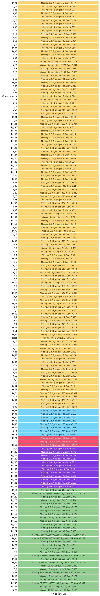

# KAGGLE-AMEX
Kaggle Amex competition in 2022 Summer

## INFO:
- I took part in this contest in my exiguous free time (when my children fall asleep after 10 pm), so this project is not full
- In phase of aggregation I lost more than 2% accuracy besause of lack of memory. The size of traning and test data is more than 25GB, so I coud do just the basic aggregation after groupby. Top10 contestens created more than 5k new columns after aggregation (for example lag features)   
- The winner achived 0.8+ accuracy.
- I achived 0.78 accuracy (3000. place from 5000)

## The dataset

American express credit card dataset.
The goal is to "guess" which customer can not pay back his credit card debt.
The training set contains 1M+ rows and 200+ anonymized columns.

## My solution
1. Basic preprocessing and aggregation
~ 12 categorical cols were officially predefined. Here I lost the chance to enter the top5% because of lack of computer memory (lag features)
```
train_num_agg = train_data.groupby("customer_ID")[num_features].agg(['first', 'last'])
train_num_agg.columns = ['_'.join(x) for x in train_num_agg.columns]
train_num_agg.reset_index(inplace = True)
train_cat_agg = train_data.groupby("customer_ID")[cat_features].agg(['count', 'last', 'nunique'])
train_cat_agg.columns = ['_'.join(x) for x in train_cat_agg.columns]
train_cat_agg.reset_index(inplace = True)
train_data = train_num_agg.merge(train_cat_agg, how = 'inner', on = 'customer_ID').merge(train_lbls, how = 'inner', on = 'customer_ID')
del train_num_agg, train_cat_agg
```
Labelencoding:
```
for cat_col in cat_features:
    encoder = LabelEncoder()
    train_data[cat_col] = encoder.fit_transform(train_data[cat_col])
    test_data[cat_col] = encoder.transform(test_data[cat_col])
```
2. Missing EDA

There are couple completly useless or highly correlated columns.
```
background_color = 'white'
custom_colors = ["#ffd670","#70d6ff","#ff4d6d","#8338ec","#90cf8e"]
missing = pd.DataFrame(columns = ['% Missing values'],
                       data = train_data.isnull().sum()/len(train_data)*100)
unique = pd.DataFrame(columns = ['Unique'],data = train_data.nunique())
big_dataframe = pd.merge(missing, 
                         unique, 
                         left_index=True, 
                         right_index=True).sort_values(by=['% Missing values'])
corr = train_data.corr().loc[:, 'target'].round(decimals = 3).astype('string')

big_dataframe = pd.merge(big_dataframe, 
                         corr, 
                         left_index=True, 
                         right_index=True)
big_dataframe['labels'] = "Missing: " + big_dataframe['% Missing values'].astype('string') + " ,N_unique: " + big_dataframe['Unique'].astype('string')+" ,Corr: "+big_dataframe['target']

fig = plt.figure(figsize = (20, 60),facecolor=background_color)
gs = fig.add_gridspec(1, 2)
gs.update(wspace = 0.5, hspace = 0.5)
ax0 = fig.add_subplot(gs[0, 0])
for s in ["right", "top","bottom","left"]:
    ax0.spines[s].set_visible(False)

sns.heatmap(big_dataframe[['% Missing values']],cbar = False,annot = big_dataframe[['labels']] ,
            fmt ="", linewidths = 2,cmap = custom_colors,vmax = 1, ax = ax0)

plt.show()   
```
Result:
After the round trick I realised there are 30+ other, hidden categorical columns.


3. Round trick
Both the competitors and I noticed that randon noise where added to the data.
```
features = [col for col in train_data.columns if col not in ['customer_ID','S_2','S_2_max', CFG.target]]
features = [col for col in features if col not in cat_features]
# round trick
for col in features:
    if train_data[col].dtype=='float64':
        train_data[col] = train_data[col].astype('float32').round(decimals=2).astype('float16')
        test_data[col] = test_data[col].astype('float32').round(decimals=2).astype('float16')
```


4. EDA

```
#%% KDE EDA minden oszlopra

del_cols = [c for c in train_data.columns if (c.startswith(('D','t'))) & (c not in cat_features)]
df_del = train_data[del_cols]
spd_cols = [c for c in train_data.columns if (c.startswith(('S','t'))) & (c not in cat_features)]
df_spd = train_data[spd_cols]
pay_cols = [c for c in train_data.columns if (c.startswith(('P','t'))) & (c not in cat_features)]
df_pay = train_data[pay_cols]
bal_cols = [c for c in train_data.columns if (c.startswith(('B','t'))) & (c not in cat_features)]
df_bal = train_data[bal_cols]
ris_cols = [c for c in train_data.columns if (c.startswith(('R','t'))) & (c not in cat_features)]
df_ris = train_data[ris_cols]
```
```
#%% KDE EDA minden oszlopra: Distribution of Payment Variables
fig, axes = plt.subplots(1, 3, figsize = (12,4))
fig.suptitle('Distribution of Payment Variables',fontsize = 35)
for i, ax in enumerate(axes.reshape(-1)):
    if i < len(pay_cols) - 1:
        sns.kdeplot(x = pay_cols[i], hue ='target', data = df_pay, fill = True, ax = ax, palette =["#e63946","#8338ec"])
        ax.tick_params()
        ax.xaxis.get_label()
        ax.set_ylabel('')
        ax.set_xlabel(pay_cols[i] ,fontsize=30)
plt.tight_layout()
plt.show()
```


5. Feature engineering: binning

I realised that there are binned columns, for example [0,1,3,4,5...] or [0.1, 0.2, 0.3....] but there are hidden because of the random noise. These part of the script is completelly my own solution (perhaps its effectiveness is questionable, there was no time to test is thoroughly) 
```
#%% FEATURE engineering DEF

bin_to_step_1 = [-0.5]
step = 1
for i in range(1,52,1):
    bin_to_step_1.append(bin_to_step_1[-1]+step)
    
bin_to_step_05 = [-0.25]
step = 0.5
for i in range(1,100,1):
    bin_to_step_05.append(bin_to_step_05[-1]+step)

bin_to_step_033 = [-0.33/2]
step = 0.33
for i in range(1,150,1):
    bin_to_step_033.append(bin_to_step_033[-1]+step)
    
bin_to_step_25 = [-0.125]
step = 0.25
for i in range(1,200,1):
    bin_to_step_25.append(bin_to_step_25[-1]+step)
    
bin_to_step_02 = [-0.1]
step = 0.2
for i in range(1,250,1):
    bin_to_step_02.append(bin_to_step_02[-1]+step)

bin_to_step_01 = [-0.05]
step = 0.1
for i in range(1,400,1):
    bin_to_step_01.append(bin_to_step_01[-1]+step)
    
bin_to_step_005 = [-0.025]
step = 0.05
for i in range(1,800,1):
    bin_to_step_005.append(bin_to_step_005[-1]+step)

def transform_to_step1(df, col):
    df[col] = np.digitize(df[col], bin_to_step_1)

def transform_to_step05(df, col):
    df[col] = np.digitize(df[col], bin_to_step_05)

def transform_to_step033(df, col):
    df[col] = np.digitize(df[col], bin_to_step_033)
    
def transform_to_step025(df, col):
    df[col] = np.digitize(df[col], bin_to_step_25)   
    
def transform_to_step02(df, col):
    df[col] = np.digitize(df[col], bin_to_step_02)

def transform_to_step01(df, col):
    df[col] = np.digitize(df[col], bin_to_step_01) 
    
def transform_to_step005(df, col):
    df[col] = np.digitize(df[col], bin_to_step_005) 

def S_19_special(df):
    df["S_19"] = df["S_19"] * 100
    df["S_19"] = np.digitize(df["S_19"], bin_to_step_1)        
 
def drop_rows_higher_than_1_1(df, col):
    df = df[df[col] < 1.1]
```

6. Train with LGBM
```
features = [col for col in train_data.columns if col not in ['customer_ID','S_2','S_2_max', CFG.target]]
params = {
    'objective': 'binary',
    'metric': "binary_logloss",
    'boosting': 'dart',
    'seed': CFG.seed,
    'num_leaves': 100,
    'learning_rate': 0.005,
    'feature_fraction': 0.20,
    'bagging_freq': 10,
    'bagging_fraction': 0.50,
    'n_jobs': -1,
    'lambda_l2': 2,
    'min_data_in_leaf': 40
    }

# Create a numpy array to store out of folds predictions
oof_predictions = np.zeros(len(train_data))
kfold = StratifiedKFold(n_splits = CFG.n_folds, shuffle = True, random_state = CFG.seed)
for fold, (trn_ind, val_ind) in enumerate(kfold.split(train_data, train_data[CFG.target])):
    print(' ')
    print('-'*50)
    print(f'Training fold {fold} with {len(features)} features...')
    x_train, x_val = train_data[features].iloc[trn_ind], train_data[features].iloc[val_ind]
    y_train, y_val = train_data[CFG.target].iloc[trn_ind], train_data[CFG.target].iloc[val_ind]
    lgb_train = lgb.Dataset(x_train, y_train, categorical_feature = cat_features)
    lgb_valid = lgb.Dataset(x_val, y_val, categorical_feature = cat_features)
    model = lgb.train(
        params = params,
        train_set = lgb_train,
        num_boost_round = 200,
        valid_sets = [lgb_train, lgb_valid],
        early_stopping_rounds = 100,
        verbose_eval = 100,
        feval = lgb_amex_metric
        )
    # Save best model
    joblib.dump(model, f'lgbm_fold{fold}_seed{CFG.seed}.pkl')
    # Predict validation
    val_pred = model.predict(x_val)
    # Add to out of folds array
    oof_predictions[val_ind] = val_pred
    # Predict the test set
    # test_pred = model.predict(test_data[features])
    # test_predictions += test_pred / CFG.n_folds
    # Compute fold metric
    score = amex_metric(y_val, val_pred)
    print(f'Our fold {fold} CV score is {score}')
    del x_train, x_val, y_train, y_val, lgb_train, lgb_valid

# Compute out of folds metric
score = amex_metric(train_data[CFG.target], oof_predictions)
print(f'Our out of folds CV score is {score}')
# Create a dataframe to store out of folds predictions
oof_df = pd.DataFrame({'customer_ID': train_data['customer_ID'], 
                       'target': train_data[CFG.target], 
                       'prediction': oof_predictions})
oof_df.to_csv(f'oof_lgbm_baseline_{CFG.n_folds}fold_seed{CFG.seed}.csv', index = False)
# Create a dataframe to store test prediction
# test_df = pd.DataFrame({'customer_ID': test_data['customer_ID'], 
#                         'prediction': test_predictions})
# test_df.to_csv(f'test_lgbm_baseline_{CFG.n_folds}fold_seed{CFG.seed}.csv', index = False)
```

7. Train with Catboost
```
features = [col for col in train_data.columns if col not in ['customer_ID','S_2','S_2_max', CFG.target]]
params = {
    'objective': 'binary',
    'metric': "binary_logloss",
    'boosting': 'dart',
    'seed': CFG.seed,
    'num_leaves': 100,
    'learning_rate': 0.01,
    'feature_fraction': 0.20,
    'bagging_freq': 10,
    'bagging_fraction': 0.50,
    'n_jobs': -1,
    'lambda_l2': 2,
    'min_data_in_leaf': 40
    }

N_FOLDS = 2
skf = StratifiedKFold(n_splits=N_FOLDS, shuffle=True, random_state=22)
y_oof = np.zeros(train_data.shape[0])
# y_test = np.zeros(test.shape[0])
ix = 0

# train_x = train_data[features]
# train_y = train_data[CFG.target]
train_x = train_data[features]
train_y = train_data[CFG.target]
for train_ind, val_ind in skf.split(train_x, train_y):
    print(f"******* Fold {ix} ******* ")
    tr_x, val_x = (
        # train_x.iloc[train_ind].reset_index(drop=True),
        # train_x.iloc[val_ind].reset_index(drop=True),
        train_x.iloc[train_ind],
        train_x.iloc[val_ind],
    )
    tr_y, val_y = (
        # train_y.iloc[train_ind].reset_index(drop=True),
        # train_y.iloc[val_ind].reset_index(drop=True),
        train_y.iloc[train_ind],
        train_y.iloc[val_ind],
    )

    clf = CatBoostClassifier(iterations=10, random_state=50)
    clf.fit(tr_x, tr_y, eval_set=[(val_x, val_y)], cat_features=cat_features,  verbose=50)
    preds = clf.predict_proba(val_x)[:, 1]
    y_oof[val_ind] = y_oof[val_ind] + preds

    # preds_test = clf.predict_proba(test)[:, 1]
    # y_test = y_test + preds_test / N_FOLDS
    ix = ix + 1
y_pred = train_y.copy(deep=True)
# y_pred = y_pred.rename({"target": "prediction"})
# y_pred.columns = ["prediction"]
# y_pred["prediction"] = y_oof
val_score = amex_metric(train_y, y_oof)
print(f"Amex metric: {val_score}")
```

9. Training results

```
# LGBM minden nélkül: 0.6683 - amex1.py
# LGBM cat col label encoder + s_2 kezelése : 0.752 - amex1.py
# LGBM cat col label encoder + s_2 kezelése : 0.752 - amex2.py (i=200, lr = 0.005)
# CAT BOOST cat col label encoder + s_2 kezelése : 0.7806 - amex2.py
# CAT BOOST cat col label encoder + s_2 kezelése : 0.7817 - amex2.py (i=400)
# CAT BOOST cat col label encoder + s_2 kezelése + round : 0.7826 - amex2.py (i=400)
# LGBM cat col label encoder + s_2 kezelése + round + bonyi kicsit : 0.752 - amex2.py (i=200, lr = 0.005)
# CAT BOOST cat col label encoder + s_2 kezelése + round + bonyi kicsit: 0.7838 - amex2.py (i=600)
# CAT BOOST  + s_2 kezelése + round + bonyi kész: 0.7827 - amex3.py (i=600)
# CAT BOOST  + s_2 kezelése + round + bonyi kész + dropna: 0.7482 - amex3.py (i=100)
# CAT BOOST  + s_2 kezelése + round + bonyi kész + fill na median and extra: 0.77834 - amex3.py (i=100)
# CAT BOOST  + s_2 kezelése + round + bonyi kész + fill na median and extra: 0.78311 - amex3.py (i=1000)
# CAT BOOST  + s_2 kezelése + round + bonyi kész + dropcol nélkül + fill na median and extra: 0.7791 - amex3.py (i=100)
# CAT BOOST  + s_2 kezelése + round + bonyi kész + összes dropcol nélkül + fill na median and extra col: 0.7840 - amex3.py (i=100)
# CAT BOOST  + s_2 kezelése + round + bonyi kész + összes dropcol nélkül + fill na median and extra col: 0.7870 - amex3.py (i=1000)
```

10. Variance filter to simplify the model

```
#%% Variance filter
# Variance filter
features_variance_filter = [col for col in train_data.columns if col not in ['customer_ID','S_2','S_2_max', 'target']]
train_data_to_filter = train_data[features_variance_filter]
n_elotte = train_data_to_filter.shape[1]
# Removing all features that have variance under 0.05
selector = VarianceThreshold(threshold = 0.05)
selector.fit(train_data_to_filter)
mask_clean = selector.get_support()
train_data_filtered = train_data_to_filter[train_data_to_filter.columns[mask_clean]]
# df_test = df_test[df_test.columns[mask_clean]]
n_utana = train_data_filtered.shape[1]
print("Variance filter után kitörölt oszlopok száma:", n_elotte-n_utana)
```

11. Automatic feature selection
The first X pc's of features selected by catboost feature importance, then the process goes further: reverse feature selection or by hand

#%% Oszlop kiválasztó definíciók és Reverse selection

```
def metric_measure(variables, df_target, df):
    X = df.loc[:,variables]
    y = df_target
    cv = RepeatedKFold(n_splits=5, n_repeats=2, random_state=global_random)
    model = xgboost.XGBRegressor(n_estimators=100)
    # print("Első kezd.")
    scores = cross_val_score(model, X, y, scoring='neg_mean_absolute_error', cv=cv, n_jobs=-1)
    score = absolute(scores).mean()
    # print("Első végez:", score)
    return score

def next_best(current_variables,candidate_variables, df_target, df):
    best_score = -1
    best_variable = None
    candidate_variables_tqdm = tqdm(candidate_variables)
    for v in candidate_variables_tqdm:
        score_v = metric_measure(current_variables + [v], df_target, df)
        if score_v >= best_score:
            best_score = score_v
            best_variable = v
    print('Aktuális legjobb a',best_variable, 'pontossága:',best_score)
    return best_variable, best_score

def next_worst(current_variables,candidate_variables, df_target, df):
    worst_score = 0
    worst_variable = None
    candidate_variables_tqdm = tqdm(candidate_variables)
    for v in candidate_variables_tqdm:
        candidate_variables = [can for can in candidate_variables if can != v]
        variables = current_variables + candidate_variables
        score_v = metric_measure(variables, df_target, df)
        if worst_score == 0:
            worst_score = score_v
        if score_v <= worst_score:
            worst_score = score_v
            worst_variable = v
    print('Aktuális legjobb a',worst_variable, 'pontossága:',worst_score)
    return worst_variable, worst_score

iternum = []
scores = []
for i in tqdm(range(0,max_number_variables)):
    print('Új kör kezdődik.')
    s = time.time()
    worst_var, best_score = next_best(current_variables,candidate_variables,df_train_target,df_train)
    # current_variables = current_variables + [next_var]
    candidate_variables.remove(worst_var)
    iternum.append(len(current_variables))
    scores.append(best_score)
    e = time.time()
    print("Betanítás 1 feature = {}".format(e-s))
    print(len(scores),'Végzett a', worst_var)
    print("Eddigi oszlopok:", current_variables)
print(current_variables)
 ``` 


